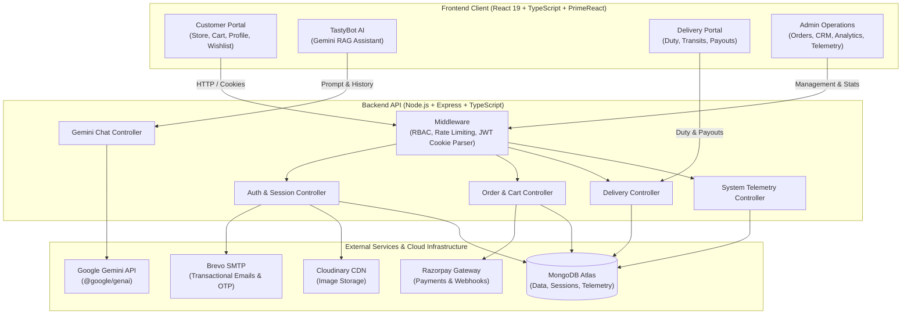

# **TastyHub — Full-Stack E-Commerce Food Ordering & Delivery Ecosystem**

[](https://react.dev/)
[](https://www.typescriptlang.org/)
[](https://primereact.org/)
[](https://nodejs.org/)
[](https://expressjs.com/)
[](https://www.mongodb.com/)
[](https://ai.google.dev/)
[](https://razorpay.com/)
[](LICENSE)

**TastyHub** is an enterprise-grade, full-stack food ordering and delivery web application designed to deliver an intuitive, high-performance dining-at-home experience. Built around a modern emerald-and-white visual identity, TastyHub unifies three interconnected portals — **Customer Experience**, **Delivery Partner Ecosystem**, and **Enterprise Admin Suite** — backed by an AI-powered conversational dining assistant (**TastyBot**), real-time order tracking, multi-gateway payments, and live system telemetry.

---

## 📑 **Table of Contents**

- [Tech Stack & Architecture](#-tech-stack--architecture)
- [Key Features & Capabilities](#-key-features--capabilities)
  - [1. Customer Dining & E-Commerce Portal](#1-customer-dining--e-commerce-portal)
  - [2. TastyBot — AI Dining Assistant (Google Gemini)](#2-tastybot--ai-dining-assistant-google-gemini)
  - [3. Cart, Multi-Payment & Checkout Engine](#3-cart-multi-payment--checkout-engine)
  - [4. Delivery Partner Ecosystem & Executive Portal](#4-delivery-partner-ecosystem--executive-portal)
  - [5. Enterprise Admin & Operations Suite](#5-enterprise-admin--operations-suite)
  - [6. Real-Time System Telemetry & Diagnostics](#6-real-time-system-telemetry--diagnostics)
  - [7. Authentication, Sessions & Security Architecture](#7-authentication-sessions--security-architecture)
- [Architecture & Workflow Diagram](#-architecture--workflow-diagram)
- [Project Directory Structure](#-project-directory-structure)
- [Environment Configuration](#-environment-configuration)
- [Installation & Local Setup](#-installation--local-setup)
- [Quality Assurance & Verification](#-quality-assurance--verification)
- [Author & License](#-author--license)

---

## ⚡ **Tech Stack & Architecture**

TastyHub leverages an end-to-end TypeScript architecture across client and server to enforce strict type contracts, eliminate runtime exceptions, and provide rapid development cycles.

| Layer | Technology | Key Capabilities & Architectural Role |
|---|---|---|
| **Frontend SPA** | **React 19** & **Vite 6** | Fast Single-Page Application (SPA) with lightning-fast Hot Module Replacement (HMR), context-driven global state (`AuthContext`), and modular routing via `react-router-dom` v7. |
| **Type Safety** | **TypeScript 5.7** | Strict compiler settings (`strict: true`, `noUnusedLocals: true`, `noUnusedParameters: true`) across both `Client` and `Server`. Clean ESLint compliance with 0 errors and 0 warnings. |
| **UI Design System** | **PrimeReact 10 & PrimeIcons** | Accessible, responsive design system. Leverages `<DataTable>`, `<Dialog>`, `<Carousel>`, `<Timeline>`, `<Card>`, `<Tag>`, `<Rating>`, `<Toast>`, and `<Sidebar>` styled with emerald-green accents and micro-animations. |
| **AI Dining Assistant** | **Google Gemini AI (`@google/genai`)** | Powers **TastyBot** with contextual Retrieval-Augmented Generation (RAG) over dishes, active coupons, combos, user orders, and dietary preferences. |
| **Backend Framework** | **Node.js & Express.js** | RESTful API built on MVC architecture with TypeScript, structured routing, centralized error handling, and CORS with credentials support. |
| **Database & ODM** | **MongoDB & Mongoose** | Distributed document database hosting Users, Sessions, Products, Carts, Orders, Combos, Coupons, Gift Cards, Reviews, Inquiries, and Telemetry. Pre-save hooks for bcrypt hashing. |
| **Authentication** | **JWT & Google OAuth 2.0** | Secure HttpOnly cookies + Bearer token authorization, MongoDB-backed 30-day session caching (`UserSession`), and Google Social Sign-In via `google-auth-library`. |
| **Payment Gateway** | **Razorpay SDK** | Real-time payment orders, client-side checkout integration, and server-side HMAC-SHA256 signature verification. |
| **Email Communications** | **Brevo (formerly Sendinblue)** | Automated transactional emails, welcome onboarding messages, and 6-digit OTP codes for secure password resets. |
| **Media Storage** | **Cloudinary SDK** | Cloud-based media storage and image transformations for user profile avatars, product photos, and restaurant banners. |
| **Document Generation** | **jspdf & jspdf-autotable** | Client-side dynamic PDF compilation for itemized, printable customer order receipts and invoices. |
| **Data Visualization** | **Chart.js & react-chartjs-2** | Interactive multi-axis charts, telemetry graphs, and sales analytics across weekly, monthly, and yearly metrics. |

---

## 🌟 **Key Features & Capabilities**

### 1. Customer Dining & E-Commerce Portal

*   **Interactive Food Store & Catalog**:
    *   **MNC-Style Quick Filter Pills**: One-click toggles (e.g., *"Pure Veg"*, *"4.5+ Rating"*, *"Under ₹300"*, *"Non-Veg"*) for instant category filtering.
    *   **Advanced Filter Panel**: Expandable filter drawer with slider/number price ranges (`minPrice` / `maxPrice`), minimum star ratings, category filters, and sorting (price low-to-high, high-to-low, newest).
    *   **Unified Aspect-Ratio Cards**: Clean product cards with standardized 200px imagery, category tags, price discounts, ratings, and instant add-to-cart/wishlist triggers.
*   **Comprehensive Food Details Dialog**:
    *   Responsive **900px detail modal** available across Home, Store, New Arrivals, and Deals.
    *   Displays calorie metrics, allergen advisories, age recommendations, dashed amber ingredient tag grids, and authenticated customer reviews with star ratings.
*   **Wishlist & Favorites Suite**:
    *   Dedicated **Wishlist Page** (`/user/wishlist`) allowing users to save their favorite dishes.
    *   Responsive multi-column grid layout with smooth hover elevation, instant removal, and one-click transfer into the shopping cart.
*   **Order Tracking & Interactive Delivery Stepper**:
    *   **Horizontal Progress Stepper**: Built using PrimeReact `<Timeline>` with green progress indicators, active spinning loaders (`pi pi-spin pi-spinner`) for active cooking/transit steps, and assigned carrier cards.
    *   **Client-Side PDF Invoices**: Instant generation and download of formatted, printable tax invoices via `jspdf` and `jspdf-autotable`.
    *   **Order Cancellation & Instant Refund**: Cancel pending orders with instant refunds credited back to the customer's in-app wallet or source payment method.
*   **Customer Profile & Account Hub**:
    *   **Tabbed Dashboard**: 4 structured tabs for *Account Details*, *Order History*, *Gift Cards*, and *Dynamic Coupons*.
    *   **Profile Picture Management**: Upload custom avatar photos directly to Cloudinary with interactive camera button and spinner status feedback.
    *   **Saved Addresses**: Manage multiple shipping addresses that automatically pre-fill during checkout.
    *   **Security Actions**: Update password, review login sessions, and manage account preferences.

---

### 2. TastyBot — AI Dining Assistant (Google Gemini)

*   **Intelligent Conversational Agent**:
    *   Embedded floating chat widget available across all customer-facing routes with a personalized greeting teaser and animated toggle.
    *   Powered by the official **Google Gemini API** (`@google/genai`) to provide fast, context-aware culinary suggestions.
*   **Contextual Retrieval-Augmented Generation (RAG)**:
    *   Retrieves live catalog data: dishes, categories, spice levels, calorie counts, and ingredients.
    *   Injects active promotional coupons, limited-time combo deals, and frequently asked questions (FAQs).
    *   Understands authenticated customer context (current cart contents, recent order history, delivery addresses).
*   **Persistent Conversation History**:
    *   Maintains conversation continuity across page reloads via session storage for guests and MongoDB database persistence (`ChatHistory` collection) for authenticated users.
    *   Options to view, continue, or clear chat transcripts at any time.

---

### 3. Cart, Multi-Payment & Checkout Engine

*   **Smart Shopping Cart**:
    *   Persistent cart synchronized with MongoDB for authenticated customers and preserved across sessions.
    *   Quantity increment/decrement controls, real-time item subtotal updates, and empty state navigation.
*   **Multi-Method Payment & Checkout**:
    *   **Razorpay Online Payments**: Seamless credit/debit card, UPI, and NetBanking checkouts with cryptographic verification.
    *   **Cash on Delivery (COD)**: Pay upon food arrival.
    *   **In-App Wallet**: Redeem accumulated balances directly toward order totals.
    *   **Gift Card Application**: Apply 16-digit gift vouchers with instant balance deduction.
    *   **Promotional Coupons**: Auto-calculate percentage and flat discounts against minimum cart thresholds.
    *   **Free Delivery Calculator**: Dynamic delivery fee calculations with progress bar showing remaining amount required for free shipping (e.g., orders above ₹200).
*   **Celebration Experience**:
    *   Full-screen confetti explosion powered by `canvas-confetti` upon successful order placement.

---

### 4. Delivery Partner Ecosystem & Executive Portal

*   **Partner Landing & Onboarding Page (`/delivery`)**:
    *   Dedicated landing page showcasing partner benefits, weekly earning potential, flexible shifts, requirements, and an onboarding registration funnel.
*   **Real-Time Carrier Duty Control**:
    *   Toggle between **Online** and **Offline** states directly from the delivery dashboard to control order assignment availability.
*   **Active Transits & Fulfillment Pipeline**:
    *   Live queue of assigned delivery orders with customer delivery address, contact phone shortcut, and itemized food manifests.
    *   One-click delivery progress pipeline: `Accepted` ➔ `Preparing` ➔ `Pickup` ➔ `Out for Delivery` ➔ `Delivered`.
*   **Dynamic Earnings & Bank Payouts**:
    *   **Calculated Lifetime Earnings**: Dynamic calculation based on completed deliveries (`completedDeliveries * ₹30`).
    *   **Withdrawable Balance Ledger**: Automatically deducts pending and approved payouts in real time.
    *   **Bank Transfer Requests**: Structured payout dialog collecting Accountant Name, Account Number, and IFSC Code (enforcing a ₹100 minimum threshold).
    *   **Withdrawal History Table**: Track historical payout requests with color-coded status badges (`Pending`, `Approved`, `Rejected`).

---

### 5. Enterprise Admin & Operations Suite

*   **Executive Performance Analytics (`/admin/home`)**:
    *   Real-time revenue, order count, and customer metrics displayed through interactive **Chart.js** bar charts.
    *   Dual-axis layouts with custom bar dimensions (`barPercentage: 0.6`) across weekly, monthly, and yearly intervals.
*   **Order Operations Center (`/admin/ordermanagement`)**:
    *   Filter and search customer orders with real-time delivery status updates.
    *   Assign available delivery executives to incoming orders.
    *   Trigger order cancellations, process instant customer refunds, and generate PDF invoices on demand.
*   **Menu & Product Engineering (`/admin/productspage`)**:
    *   Full CRUD control over catalog items: add dish titles, descriptions, pricing, discount rates, high-res images, categories, calorie counts, and ingredient lists.
*   **Customer Relationship Management (CRM) (`/admin/customers`)**:
    *   Comprehensive customer directory displaying user profiles, registration dates, active orders, verification status, and wallet balances.
*   **Support Inquiries Desk (`/admin/inquiries`)**:
    *   Review customer inquiries submitted via the Contact page.
    *   Filter inquiries by resolution state and send direct email/in-app responses back to the customer.
*   **Promotions & Deals Hub**:
    *   **Dynamic Coupons (`/admin/coupons`)**: Create promo codes with percentage discounts, minimum cart thresholds, and expiry dates.
    *   **Combo Deals (`/admin/combodeals`)**: Bundle multiple dishes into limited-time feast packages with access limits and expiration countdowns.
    *   **Gift Cards Management (`/admin/giftcards`)**: Issue and track custom gift voucher batches.
*   **Dining & Banners Operations (`/admin/restaurants`)**:
    *   Tabbed management (`?tab=restaurants` / `?tab=banners`) to manage featured partner restaurants and dynamic hero promotional banners.
*   **Live Admin Notifications Drawer**:
    *   Slide-out drawer polling every 30 seconds for real-time alerts on new orders and carrier withdrawal requests with unread counters and 1-click "Mark as Read".

---

### 6. Real-Time System Telemetry & Diagnostics

Accessible to administrators at `/admin/systemstats`, this module provides live operational health metrics:

*   **System Health Monitor**: Live statuses for API availability, MongoDB database connectivity, and round-trip ping latency (in ms).
*   **API Traffic & Throughput Analytics**:
    *   Total requests handled, currently active requests, and HTTP status code distribution (2xx, 3xx, 4xx, 5xx).
    *   Response time metrics: Average, minimum, and maximum latency across all requests.
    *   Endpoint profiling table identifying request volume, average latency, and error counts per route.
*   **MongoDB Diagnostics**:
    *   Collection statistics, document counts (Users, Products, Orders, Restaurants), raw data size, index size, and average object footprint.
*   **Real-Time Request Stream**:
    *   Live feed of recent HTTP requests detailing HTTP method, path, response status code, latency (ms), client IP address, and timestamp.

---

### 7. Authentication, Sessions & Security Architecture

*   **Role-Based Access Control (RBAC)**:
    *   Strict role boundaries separating `user`, `admin`, and `delivery_executive` roles with client-side protected route guards and server-side authorization middleware.
*   **Database-Backed Persistent Sessions**:
    *   Replaces vulnerable local storage session tokens with secure **HttpOnly cookies** synchronized with a MongoDB `UserSession` collection with a 30-day Time-To-Live (TTL) auto-expiry.
    *   Retains "Remember Me" sessions across browser restarts while securing access credentials.
*   **Google OAuth 2.0 Integration**:
    *   One-click social sign-in via Google OAuth, automatically provisioning user profiles and session tokens.
*   **One-Click Evaluator Guest Account**:
    *   Instant **"Login as Guest Customer"** button on the authentication screen (`guest_customer@tastyhub.com`).
    *   Pre-funded with **₹1,000.00 wallet balance** (auto-refills if balance drops below ₹100) allowing reviewers to test the complete order lifecycle without credit cards.
*   **Password Reset via Email OTP**:
    *   Brevo transactional email integration delivering time-sensitive 6-digit OTP verification codes.
*   **Interactive Password Visibility Toggles**:
    *   Embedded eye/eye-slash icons (`pi pi-eye` / `pi pi-eye-slash`) on password fields across User, Admin, and Delivery portals.

---

## 🏛️ **Architecture & Workflow Diagram**



---

## 📁 **Project Directory Structure**

```
TastyHub-E-Commerce-Website/
├── Client/                             # React 19 Frontend Application
│   ├── public/                         # Public static assets & favicon
│   ├── src/
│   │   ├── Components/                 # Reusable UI components (Navbar, Footer, AdminLayout, etc.)
│   │   │   ├── AdminLayout.tsx         # Collapsible sidebar admin dashboard layout
│   │   │   ├── ChatbotWidget.tsx       # TastyBot AI assistant floating widget
│   │   │   ├── FoodNavbar.tsx          # Main navigation with ticker & cart count
│   │   │   ├── FoodFooter.tsx          # Footer with social & quick links
│   │   │   └── ProtectedRoute.tsx      # Role-based route authorization guard
│   │   ├── context/                    # React Context (AuthContext & Cart state)
│   │   ├── Pages/                      # Application route pages
│   │   │   ├── Admin/                  # Operations, Analytics, Products, CRM, Telemetry
│   │   │   ├── Customer/               # Home, Store, Cart, Checkout, Wishlist, Profile
│   │   │   └── Delivery/               # Partner Landing, Auth, Dashboard & Payouts
│   │   ├── styles/                     # Global stylesheet definitions & PrimeReact theme overrides
│   │   ├── types/                      # TypeScript interface declarations
│   │   ├── utils/                      # Date formatters & calculation helpers
│   │   ├── App.tsx                     # Main router and toast container
│   │   └── main.tsx                    # React DOM root mounting
│   ├── eslint.config.js                # ESLint flat config with TypeScript rules
│   ├── package.json                    # Frontend dependencies & scripts
│   ├── tsconfig.app.json               # Frontend TypeScript compiler options
│   └── vite.config.ts                  # Vite build configuration
│
├── Server/                             # Node.js + Express Backend Application
│   ├── src/
│   │   ├── Config/                     # MongoDB connection & Cloudinary setup
│   │   ├── Controller/                 # Request handlers (Auth, Orders, Chat, Delivery, etc.)
│   │   │   ├── AuthController.ts       # Sign-in, sign-up, Google OAuth, session cookies
│   │   │   ├── ChatController.ts       # Google Gemini AI contextual RAG engine
│   │   │   ├── DeliveryController.ts   # Carrier status, orders, lifetime earnings & payouts
│   │   │   ├── OrderController.ts      # Checkout, lifecycle status, refunds
│   │   │   ├── ProductController.ts    # Product catalog management
│   │   │   └── SystemStatsController.ts# API latency, requests & database health metrics
│   │   ├── Middleware/                 # Auth verification, RBAC, and rate limiting
│   │   ├── Models/                     # Mongoose document schemas
│   │   ├── Routes/                     # REST route endpoints
│   │   ├── Types/                      # Backend TypeScript interfaces
│   │   ├── Utils/                      # Brevo email templates & invoice generators
│   │   └── index.ts                    # Express app initialization & server entrypoint
│   ├── package.json                    # Backend dependencies & scripts
│   └── tsconfig.json                   # Backend TypeScript compiler options
│
└── README.md                           # Comprehensive project documentation
```

---

## ⚙️ **Environment Configuration**

Before running the application, configure your environment variables in both the `Server` and `Client` directories.

### 1. Server Configuration (`Server/.env`)

```env
# Server Runtime
PORT=5000
NODE_ENV=development
FRONTEND_URL=http://localhost:5173

# Database
MONGO_URI=your_mongodb_atlas_connection_string

# Authentication & Sessions
JWT_SECRET=your_super_secret_jwt_key
JWT_EXPIRE=7d
COOKIE_EXPIRE=7
ADMIN_EMAIL=admin@tastyhub.com

# Google OAuth 2.0 (Social Sign-In)
GOOGLE_LOGIN_CLIENT_ID=your_google_oauth_client_id
GOOGLE_LOGIN_CLIENT_SECRET=your_google_oauth_client_secret
GOOGLE_REDIRECT_URI=http://localhost:5173

# Google Gemini AI (TastyBot Assistant)
GEMINI_API_KEY=your_gemini_api_key

# Razorpay Payment Gateway
RAZORPAY_API_KEY=your_razorpay_key_id
RAZORPAY_SECRET_KEY=your_razorpay_key_secret

# Cloudinary (Media Storage)
CLOUDINARY_CLOUD_NAME=your_cloudinary_cloud_name
CLOUDINARY_API_KEY=your_cloudinary_api_key
CLOUDINARY_API_SECRET=your_cloudinary_api_secret

# Brevo SMTP (Transactional Emails & OTP)
BREVO_API_KEY=your_brevo_api_key
BREVO_FROM_EMAIL=no-reply@tastyhub.com
BREVO_FROM_NAME=TastyHub
```

### 2. Client Configuration (`Client/.env`)

```env
VITE_BACKEND_URL=http://localhost:5000
VITE_RAZORPAY_KEY_ID=your_razorpay_key_id
```

---

## 🚀 **Installation & Local Setup**

### Prerequisites
- **Node.js** (v18.0.0 or higher recommended)
- **npm** (v9.0.0 or higher)
- **MongoDB Atlas** cluster or local MongoDB instance

### Step 1: Clone the Repository
```bash
git clone https://github.com/harikrishna87/TastyHub-E-Commerce-Website.git
cd TastyHub-E-Commerce-Website
```

### Step 2: Install and Run the Backend Server
```bash
cd Server
npm install
npm run build      # Compiles TypeScript files into dist/
npm start          # Starts server on http://localhost:5000
```
> Alternatively, run `npm run dev` for development with automatic restarts.

### Step 3: Install and Run the Frontend Client
Open a new terminal tab or window:
```bash
cd Client
npm install
npm run dev        # Launches Vite development server on http://localhost:5173
```

### Step 4: Access the Application
- **Customer Portal**: `http://localhost:5173`
- **Delivery Partner Portal**: `http://localhost:5173/delivery`
- **Admin Sign-In**: `http://localhost:5173/admin/auth`
- **Instant Guest Testing**: Click **"Login as Guest Customer"** on the customer sign-in page to explore all features with a pre-loaded ₹1,000 wallet balance.

---

## 🧪 **Quality Assurance & Verification**

TastyHub maintains strict code quality and type safety standards:

```bash
# Run ESLint across the Client codebase (0 errors, 0 warnings enforced)
cd Client
npm run lint

# Compile and verify TypeScript project build
npm run build
```

---

## 👤 **Author**

*   **Veta Hari Babu** — *Full Stack Software Developer*
*   GitHub: [@harikrishna87](https://github.com/harikrishna87)

---

## 📄 **License**

This project is open-source and licensed under the [MIT License](LICENSE). You are welcome to use, study, and build upon this software with appropriate credit.
